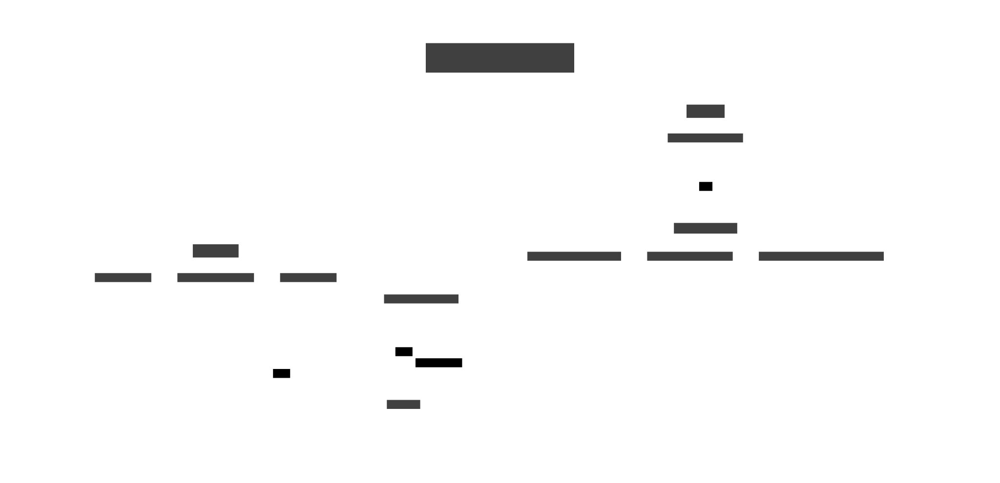

# desk-display

⚠️ Draft project, dirty code 🫢


## Goals

My project is to create a customizable DIY tablet that meets my specific needs. 

It will be more versatile than a typical stream deck, featuring a larger touchscreen for improved usability. The goal is to design a device where I can integrate whatever tools or functions I want, tailored to my workflow.

Additionally, I'll be repurposing a Raspberry Pi that's been sitting unused in my drawer, making the project both practical and sustainable.

## Materials

- [Waveshare 9.3inch Capacitive Touch Display](https://www.waveshare.com/product/raspberry-pi/displays/lcd-oled/9.3inch-1600x600-lcd.htm)
- [Wiki Waveshare 9.3inch](https://www.waveshare.com/wiki/9.3inch_1600x600_LCD#Resource)
- ~~[RaspberryPi 3B](https://www.raspberrypi.com/products/raspberry-pi-3-model-b/)~~ (too old, bad performance)
- [RaspberryPi 5 4GB](https://www.raspberrypi.com/products/raspberry-pi-5/)
- [Support / Stand 3D Model](https://www.thingiverse.com/thing:6439195)


## Stack

- Nuxt 3
- Node-RED
- Home Assistant
- PocketBase
- NocoDB
- Golang / Python
- ...

## Communication



There is a small API written in Golang running on a Raspberry Pi using the DietPi OS.

This API is designed to execute commands to control the screen, leveraging tools like ddcutil.

It allows for tasks such as adjusting the screen brightness or turning the screen off. [See this file](docs/ddcutil.md)

Additionally, this API serves as a bridge to integrate with tools like Node-RED, enabling seamless integration into automation scenarios.

## DietPi

### `config.txt`

```shell
vi /boot/config.txt
```

```sh
# from https://www.waveshare.com/wiki/9.3inch_1600x600_LCD
hdmi_group=2
hdmi_mode=87
hdmi_cvt=1600 600 60 6 0 0 0

# improve GPU mem
gpu_mem_256=256
gpu_mem_512=256
gpu_mem_1024=256

arm_64bit=1
dtoverlay=vc4-kms-v3d

# to deliver enouth current to display
max_usb_current=1
usb_max_current_enable=1 # for rpi 5

# In order to use `ddcutil` with `i2c` add: 
dtparam=i2c2_iknowwhatimdoing
```

### `chromium-autostart.sh`

```shell
vim /var/lib/dietpi/dietpi-software/installed/chromium-autostart.sh
```

[chromium-autostart.sh](.dietpi/chromium-autostart.sh)

### Misc

#### Timezone

```shell
# show TZ
date +%Z

# set new TZ
timedatectl set-timezone Europe/Paris
```

## Photos


## 3D Model Stand
[Dis_left v1.stl](docs/3d/Dis_left%20v1.stl)

[DIs_right v1.stl](docs/3d/DIs_right%20v1.stl)


